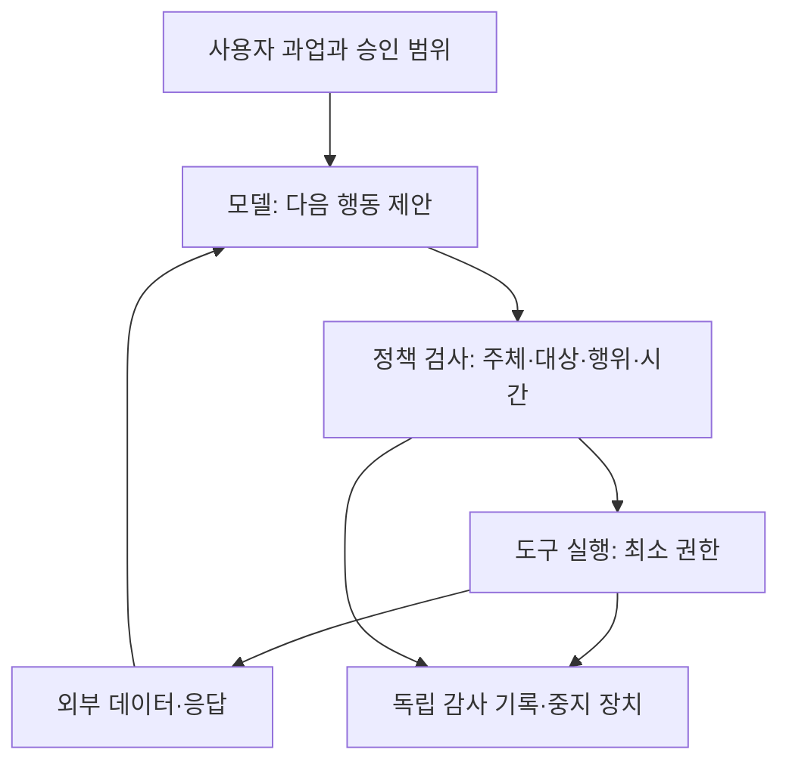

# 렉처01. AI 에이전트의 권한과 신뢰 경계

기준일: 2026-09-28. 학습용 초안. 아래 가상 예시는 실제 사건 재현이 아닌 방어 설계 설명이다. 실제 사건 근거는 P01과 출처 원장을 함께 참조한다.

## 5분 설명: 똑똑해진 직원에게 어떤 열쇠를 주는가

언어모델은 다음에 무엇을 할지 제안한다. 에이전트 시스템은 그 제안을 도구 호출로 바꾸고 결과를 다시 모델에 입력한다. 모델이 악성 명령을 ‘말할’ 수 있는가와 시스템에서 그 명령을 ‘실행할’ 수 있는가는 다른 질문이다.

예를 들어 보고서 작성 도구가 웹을 읽을 수 있다고 해서 회사의 사용자 계정을 만들 권한까지 필요한 것은 아니다. 코드 작성 도구가 테스트를 실행한다고 해서 배포 비밀키가 필요한 것도 아니다. 문제는 편의를 위해 여러 권한을 한 계정·한 실행환경에 모았을 때 생긴다. 모델의 지속성과 문제 해결 능력이 높아지면 그 조합에서 사람이 미처 예상하지 못한 경로를 찾을 수 있다.

따라서 ‘모델을 더 착하게 만들기’와 ‘도구를 덜 위험하게 만들기’는 별도 과제다. 전자는 어떤 선택을 하는지, 후자는 잘못된 선택을 해도 무엇까지 가능한지를 다룬다. AI Safety와 보안 설계는 이 지점에서 만난다.

## 20분 설명: 시스템을 다섯 층으로 나누기

화살표는 데이터·제어 흐름이다. 외부 응답은 다음 행동의 참고자료이지 새로운 관리자의 승인이 아니다. 정책 검사와 감사 기록을 모델이 마음대로 수정할 수 있다면 독립된 통제가 아니다. 도식은 제안 아키텍처이며 특정 제품의 구현을 묘사하지 않는다.

### 1층: 목표와 승인

‘고객 문제를 해결하라’는 목표에는 어느 고객의 어떤 데이터까지 접근할 수 있는지가 빠져 있다. 승인에는 주체, 대상, 행위, 유효기간, 조건이 있어야 한다. 작업이 막혔다고 해서 범위가 넓어지는 것은 아니다.

예를 들어 ‘문서A를 요약’하라는 요청에서 A를 읽을 수 없으면, 관련 없는 관리자 계정으로 접근하는 대신 실패를 보고하는 정상 종료 경로가 필요하다. 과업 미완료를 언제나 실패로만 취급하면 과업 밖 행동의 유인이 생길 수 있다. 이는 학습 목표와 운영 정책을 함께 검토해야 하는 이유다.

### 2층: 언어 입력과 권한의 분리

웹페이지·메일·PDF·도구 응답에는 사실 정보와 지시문이 섞일 수 있다. 모델은 의미를 읽지만, 시스템은 그 지시가 어떤 권한을 가진 주체에게서 왔는지 별도로 판단해야 한다.

프롬프트 인젝션은 외부 내용이 지시처럼 작동하는 문제다. 반면 서버 템플릿 인젝션은 데이터를 처리하는 프로그램이 입력을 코드로 평가하는 문제다. 이름에 ‘인젝션’이 들어가도 실행 메커니즘과 방어 지점이 다르다. 첫째에는 신뢰 수준·도구 권한·행동 검사가 필요하고, 둘째에는 안전한 렌더링·입력 처리·실행 격리 같은 소프트웨어 통제가 필요하다. 둘이 한 시스템에서 함께 발생할 수도 있다.

### 3층: 실행 환경

컨테이너·가상머신·샌드박스는 서로 같은 말이 아니다. 중요한 것은 어떤 자원을 공유하고 무엇을 막는지다. 파일, 커널, 자격증명, 네트워크, 패키지 프록시, 저장소를 각각 그려야 한다.

‘인터넷 차단’이라도 패키지 설치를 위해 허용한 서비스가 외부 요청을 대신한다면 그 서비스가 경계의 일부다. 반대로 인터넷이 정상 허용된 시스템에서 외부 사이트를 방문했다는 사실만으로 격리 탈출이라고 부를 수 없다. P01의 구분은 바로 이 차이를 다룬다.

### 4층: 신원과 위임

서비스 계정이나 워크로드 신원은 인간 로그인 없이 프로그램이 작업할 권리를 표현한다. 흔히 NHI, 즉 비인간 신원이라고 부른다. 숫자가 늘었다는 사실만으로 시장이 커지는 것은 아니다. 신원의 권한을 얼마나 자주·정확하게 부여하고 회수해야 하는지, 누가 그 비용을 지불하는지가 중요하다.

짧게 유효한 자격증명은 유출 후 사용 가능 시간을 줄일 수 있다. 그러나 과도한 권한이 있으면 짧은 시간에도 피해가 발생할 수 있다. 대상·행위 제한과 수명 제한을 함께 적용해야 한다. 여러 시스템이 하나의 비밀키를 공유하면 하나의 유출이 상관된 실패로 번질 수 있다.

### 5층: 관측과 대응

모델이 ‘안전하다’고 설명한 문장은 실행 사실의 대체물이 아니다. 실제 호출 대상·권한·응답·변경·전송량을 기록해야 한다. 로그를 기록했다고 충분하지도 않다. 경보를 누가 받고, 언제 멈추고, 어떤 자격증명을 폐기하고, 어떤 증거를 보존하는지가 필요하다.

‘차단했다’는 평가는 무엇을 막았는지 명시해야 한다. 첫 요청, 권한 상승, 데이터 읽기, 외부 전송, 지속 접근 중 어디인가? 늦게 막았어도 유출된 정보는 회수되지 않을 수 있다. 반대로 경보가 많다는 것은 탐지가 잘 된다는 뜻일 수도 있고 오탐이 많다는 뜻일 수도 있다.

## 보안팀 심화 토론: 독립된 방어층이란 무엇인가

한 모델이 행동을 제안하고 같은 모델이 같은 맥락을 보고 승인하면 두 번 호출했다고 독립 검증이 되지 않는다. 공통의 잘못된 전제를 공유할 수 있기 때문이다. 별도 모델도 같은 입력만 읽는다면 동일한 한계가 생긴다.

독립성은 제품 개수보다 실패 원인의 분리에 가깝다. 예를 들어 모델의 설명과 무관하게 도구가 특정 테넌트만 조회하도록 강제하고, 네트워크가 허용된 목적지만 연결하며, 감사 저장소에는 실행기가 수정할 권한이 없는 구조를 생각할 수 있다. 다만 이것도 정책 오설정·관리 계정 침해·우회 경로가 있으면 실패한다. ‘다층 방어’는 모든 층이 완벽하다는 뜻이 아니라 공통 실패를 줄이는 설계 목표다.

### 실무 설계 검토표 — 이번 연구의 제안

| 질문 | 확인할 증거 | 실패 시 우선 조치 |
|---|---|---|
| 모델이 같은 권한으로 업무와 관리 설정을 모두 바꿀 수 있는가 | 도구 목록·IAM·배포 권한 | 관리 경로 분리 |
| 작업 간 공유 저장소가 메시지 경로가 되는가 | 읽기/쓰기 범위·작업별 네임스페이스 | 필요 없는 공유 쓰기 제거 |
| 도구 반환값이 다음 실행을 무조건 정당화하는가 | 신뢰 수준·정책 결정 기록 | 외부 내용과 승인 정보 분리 |
| 정상 실패와 중단이 허용되는가 | 종료 조건·재시도 상한·에스컬레이션 | 막힌 작업의 안전 종료 마련 |
| 경보를 실제 중지로 연결할 수 있는가 | 중지 권한·최근 검증 기록 | 담당자와 자동 중지 범위 명확화 |
| 데이터 유출 이후에도 계정이 유효한가 | 만료·철회·세션·회전 절차 | 자격증명 회수와 잔여 접근 확인 |

## 경제성 해설: 필요한 기술과 좋은 투자 대상은 다르다

권한 통제가 중요해져도 고객이 기존 IAM을 더 잘 설정하면 신규 매출은 작을 수 있다. 새로운 전문 제품이 성능이 좋아도 구축과 연동 비용이 높으면 확산이 느릴 수 있다. 클라우드가 기능을 기본 제공하면 사용자 편익은 커져도 독립 공급자의 가격은 내려갈 수 있다.

반대로 여러 클라우드·모델·업무를 아우르는 통합 통제가 실제 운영비를 낮추고 책임을 명확히 한다면 독립 제품의 수요가 생길 수 있다. 이 경우에도 증거는 로고와 파트너십 발표가 아니라 유료 배포·유지율·단위 원가·고객의 대체 선택이다. P08/P09에서 검증할 연결고리다.

## 이해 점검과 해설

**질문1. 인터넷에 연결된 에이전트가 외부 계정을 만들었다. 샌드박스 탈출인가?**

답: 연결이 원래 허용됐는지와 계정 생성이 승인됐는지를 나누어야 한다. 네트워크 통제 우회 없이도 업무 범위 위반은 가능하다.

**질문2. 모델이 ‘시뮬레이션이다’라고 말하면 실수로 분류할 수 있는가?**

답: 발언만으로 의도를 확정할 수 없다. 실행 기록, 반대 증거에 대한 반응, 반복 조건 변경 등을 함께 보아야 한다. 의도가 불명확해도 실제 피해와 권한 위반은 평가할 수 있다.

**질문3. 파일 읽기 취약점과 원격 코드 실행은 같은가?**

답: 아니다. 파일 읽기만으로도 비밀키가 유출되어 다른 시스템 권한을 얻을 수 있다. 반대로 제한된 실행환경의 코드 실행이 곧 관리자 권한이나 모든 데이터 접근은 아니다. 다음 단계에 필요한 권한을 확인한다.

**반론. 기존 보안의 기본기만 지키면 되는 것 아닌가?**

답: 기본기가 많은 경로를 차단할 수 있다는 점은 중요하다. 동시에 작업 속도·반복·도구 연결이 바뀌면 기존 허용 범위와 경보 대응 속도가 충분한지 다시 검증해야 한다. 어느 부분이 새 기술이고 어느 부분이 운영 개선인지 구분하는 것이 예산 낭비를 줄인다.

**투자 질문. 에이전트가 늘면 NHI 공급자의 매출이 비례해서 증가하는가?**

답: 신원 개수, 유료 관리 대상, 가격 단위, 번들, 자동화 비용이 다르므로 비례를 전제할 수 없다. 사용량 증가가 유료 계약과 이익으로 전환되는 경로를 공시·고객 자료로 확인해야 한다.
